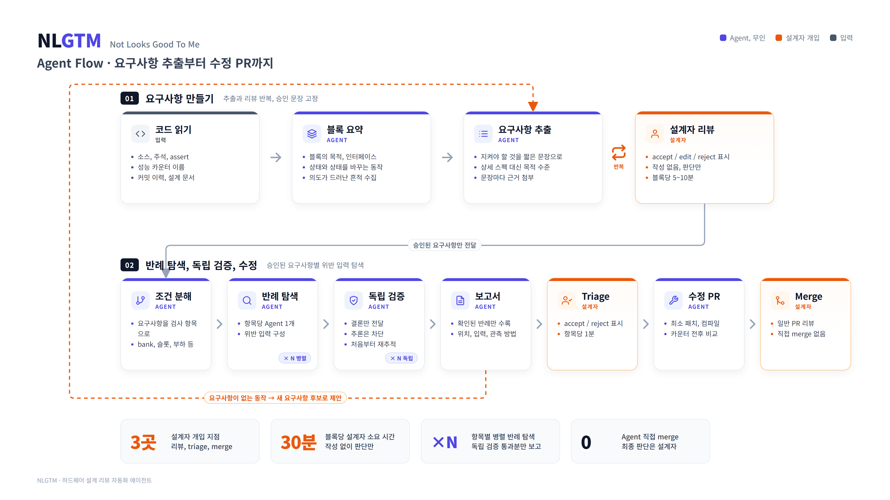
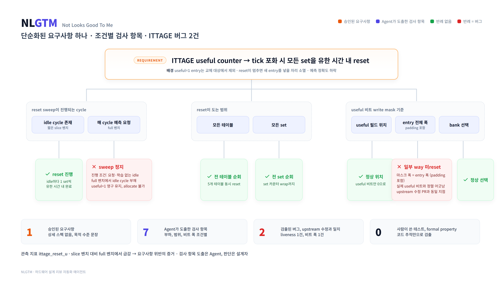

# NLGTM (Not Looks Good To Me): 코드에서 요구사항을 뽑고, 그 요구사항의 반례를 찾아 버그를 검출하는 Agent

코드를 읽어 블록별 최소 아키텍처 요약(MAS)과 단순화된 요구사항을 스스로 만들고, 사용자는 그 요구사항을 리뷰만 한다. 리뷰가 끝난 요구사항을 Agent가 반례 탐색으로 위반 입력을 찾아 버그를 검출하고, 독립 검증을 거쳐 수정 PR까지 만든다.
설계 문서: `docs/DESIGN_KR.md`

## 흐름



```
코드 ──> MAS (블록별 목적·인터페이스·상태·메커니즘) ──> 블록별 요구사항 추출 (짧게, 근거 첨부)
                                                              │
                                              사용자 리뷰: accept / edit / reject / add
                                                              │  (추출 ↔ 리뷰 반복, 안정될 때까지)
                                                              v
                                 claim 전개 ──> 반례 탐색 ──> 독립 검증 ──> 보고서
                                                              │
                                              사용자 triage: accept / reject / intentional
                                                              │
                                                              v
                                                   패치 + 컴파일 + PR ──> 사용자 merge
```

사용자가 쓰는 것은 없다. 읽고 표시만 한다. 개입 지점은 요구사항 리뷰, finding triage, PR merge 세 곳.

## 왜 이 방식인가



- Formal / UT 같은 verification 인프라가 부족해도 리뷰만으로 잡히는 버그가 대부분이다. 이 레포의 BTB invalidate, ITTAGE useful reset, FTQ meta, backend target 검증 버그가 전부 리뷰로 발견됐다. 문제는 리뷰에 드는 사람 시간이다
- 에뮬레이션(ZeBu)은 한 턴에 2~3일이다. backend target 검증 버그는 파형, 가설, 수정, 재실행을 반복하며 한 달 넘게 걸렸다. 리뷰는 턴어라운드가 없다. 리뷰를 자동화하면 그 한 달이 하루 단위로 줄어든다
- 상세 스펙은 유지되지 않는다. 단순화된 요구사항은 유지되고, 버그를 잡는 데는 그걸로 충분하다. 그것도 사람이 쓰면 안 쓰게 되므로 Agent가 쓰고 사람은 리뷰한다
- 코드에서 뽑은 요구사항은 코드의 가정을 되풀이할 위험이 있다. 그래서 요구사항은 메커니즘이 아니라 **목적**("Y일 때 X가 반드시 일어나야 한다")으로 적고, 근거(주석, assert, 카운터 이름, 커밋 제목)를 붙여 사용자가 몇 초 만에 의도 여부를 판단하게 한다
- 버그는 요구사항이 없어서가 아니라 **특정 입력 클래스에서 요구사항이 성립하지 않아서** 생긴다. 입력 클래스 전개는 Agent가 한다
- Agent 자신의 결론을 다른 Agent가 반박하게 하면 오탐이 걸러진다

## 구조

```
NLGTM/
  NLGTM.md                # Agent 본체. 언어·도메인 독립
  skills/
    extract-mas/                 # 코드 → MAS
    extract-requirements/        # MAS → 요구사항, 리뷰 반영 반복
    decompose-requirement/       # 요구사항 → claim 전개
    refute-claim/                # claim의 반례 탐색
    verify-finding/              # finding 독립 재검증
    judge-and-report/            # 병합, 심각도, 보고서, 요구사항 후보
    fix-and-compile/             # 패치, 컴파일, PR
  configs/
    _template/                   # 새 프로젝트용 템플릿
    xiangshan/                   # 이 레포용 설정
      blocks.yaml                # 블록 경로, 빌드 명령, 관측 카운터, 활성 설정
      conventions.md             # 프로젝트 규약과 분해 축
      requirements/<block>.md    # Agent가 생성, 사용자가 리뷰. 실행 간 유지되는 유일한 산출물
  examples/                      # 실행 예시
  figures/                       # 제출용 그림
  docs/                          # 설계 문서
  SUBMISSION_KR.md               # 제출 양식
```

`NLGTM.md`와 `skills/`는 어떤 프로젝트, 어떤 언어에도 그대로 쓴다. 이 레포는 Chisel(Scala DSL)이지만 Agent는 "trigger → effect", 가드, 인코딩, 폭, stale 상태, liveness, isolation이라는 일반 개념만 다룬다. 프로젝트별로 바뀌는 것은 `configs/<project>/` 뿐이다.

## 사용법 (Claude Code)

```bash
# 설치. 대상 레포(예: XiangShan_Vanilla) 안에서 실행. NLGTM 레포는 나란히 clone돼 있다고 가정
cp ../NLGTM/NLGTM.md .claude/agents/nlgtm.md
cp -r ../NLGTM/skills/* .claude/skills/

# 1. 요구사항 추출 → requirements/<block>.md 생성, 리뷰 대기
claude "Use the nlgtm agent. project=../NLGTM/configs/xiangshan block=ittage mode=extract"

# 2. 사용자가 status를 표시한 뒤 반복. "stable"이 나올 때까지
claude "Use the nlgtm agent. project=../NLGTM/configs/xiangshan block=ittage mode=iterate"

# 3. accepted 요구사항으로 감사 → out/ittage/<rev>/report.md
claude "Use the nlgtm agent. project=../NLGTM/configs/xiangshan block=ittage mode=audit"

# 4. triage 후 수정 PR
claude "Use the nlgtm agent. project=../NLGTM/configs/xiangshan mode=fix report=out/ittage/<rev>/report.md"

# PR diff 리뷰 (변경에 닿는 claim만)
claude "Use the nlgtm agent. project=../NLGTM/configs/xiangshan mode=diff base=main"
```

## 사용자가 하는 일

| 게이트 | 무엇을 | 걸리는 시간 목표 |
|---|---|---|
| 요구사항 리뷰 | 줄마다 `status:`를 accepted / edited / rejected로 표시, 필요하면 한 줄 추가(`status: owner`) | 블록당 5~10분, 2~3회 반복 |
| finding triage | report.md의 표에서 accept / reject / intentional 표시 | 항목당 1분 |
| PR merge | 일반 PR 리뷰. 실패 입력, 패치 근거, 컴파일 결과, 카운터 비교가 첨부됨 | PR당 수 분 |

## 다른 블록, 다른 프로젝트로 확장

- 같은 프로젝트의 새 블록: `blocks.yaml`에 경로 한 항목 추가 후 `mode=extract`. 요구사항은 Agent가 만든다
- 다른 프로젝트: `configs/_template/`을 복사해 `configs/<project>/` 생성. 빌드 명령과 분해 축만 채운다. 하드웨어가 아니어도 된다. 분해 축이 "bank / slot"이 아니라 "tenant / retry / partial failure"가 될 뿐이다
- 요구사항이 부족하면 감사 보고서 끝에 Agent가 요구사항 후보를 `status: proposed`로 붙인다. 사용자는 채택 여부만 표시한다

## 원칙

- 요구사항은 짧게, 목적으로. 상세 스펙 금지
- accepted 줄은 Agent가 절대 고치지 않는다. 새 줄을 제안한다
- finding에는 정의 위치 `file:line`, 실패 입력, 잘못된 결과, 관측 방법이 전부 있어야 한다. 하나라도 없으면 폐기
- Refuter와 Verifier는 서로의 추론을 보지 않는다
- Agent는 merge하지 않는다
